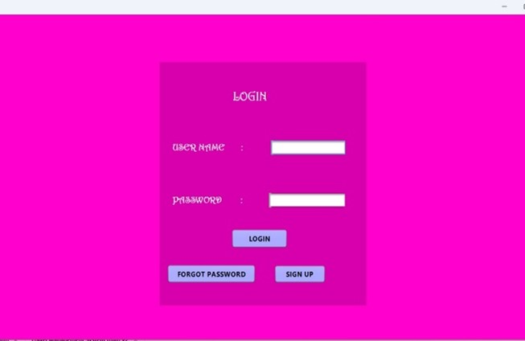
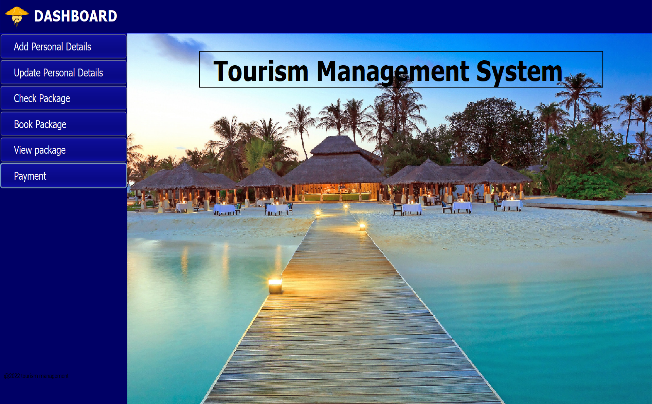
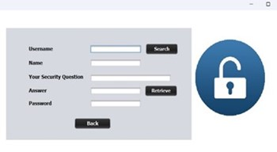
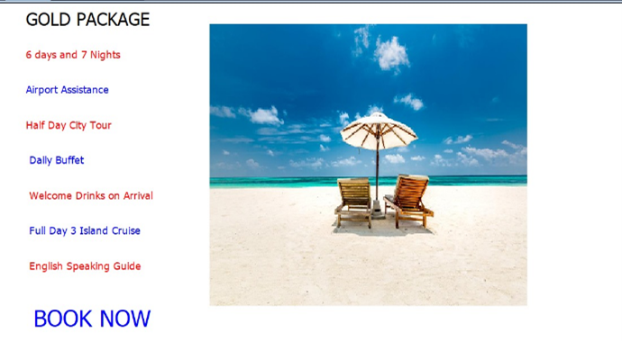
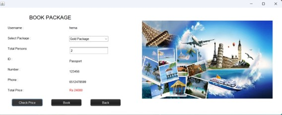

# 🧳 Travel and Tourism Management System

A Java-based desktop application that simplifies the process of travel booking and tourism management. Built with **Java Swing** for the frontend and **MySQL** for the backend, this project includes features like user authentication, travel package selection, booking confirmation, and email notifications.

---

## 📌 Features

- 🔐 **Login & Registration**: Secure user authentication system with password retrieval.
- 🧭 **Explore Packages**: View and select from a list of available travel packages.
- 🧾 **Booking System**: Book your favorite travel package and receive instant confirmation.
- 📧 **Email Notifications**: Automatic confirmation emails sent to registered users.
- 🗃️ **Database Integration**: All user and booking data stored securely in MySQL.

---

## 🛠️ Technologies Used

---

## 📸 Screenshots

| 🔑 Login Page | 📊 Main Dashboard |
|--------------|-------------------|
|  |  |

| 🔁 Forgot Password | 🧳 Travel Packages |
|--------------------|-------------------|
|  |  |

| 📦 Book Package |
|----------------|
|  |

